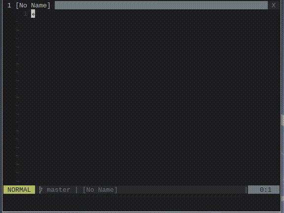

unite-grep-vcs
===============================================================================


Version: 0.1.0
Support: Vim 7.3 and above (Let me know if there are issues)

**NOTE**
`grep/git` source is now moved into the [unite](https://github.com/Shougo/unite.vim) from [this](https://github.com/Shougo/unite.vim/commit/91acd3b8b1744e6f379420ff68d8b632d2e0c149) commit.

*unite-grep-vcs* is an [unite](https://github.com/Shougo/unite.vim) source package plugin for 'git grep' or 'hg grep'.
There is a similar plugin called [sgur/unite-git_grep](https://github.com/sgur/unite-git_grep). and the difference are: 

- unite-git_grep: grep command is called when user hit key in unite interface (like incremental search)
- unite-grep-vcs: grep command is called once when user open the unite interface. This behavior is similar to 'Unite grep'.


How to install
==============================================================================

The structure of the [repository](https://github.com/lambdalisue/unite-grep-vcs) follow a standard vim plugin's directory structure thus you can use [Vundle.vim](https://github.com/gmarik/Vundle.vim) or [neobundle.vim](https://github.com/Shougo/neobundle.vim) to install vim-gista like:

```vim
" Vundle.vim
Plugin 'lambdalisue/unite-grep-vcs'

" neobundle.vim
NeoBundle 'lambdalisue/unite-grep-vcs'

" neobundle.vim (Lazy)
NeoBundleLazy 'lambdalisue/unite-grep-vcs', {
    \ 'autoload': {
    \    'unite_sources': ['grep/git', 'grep/hg'],
    \}}
```

How to use
==============================================================================

unite-grep-vcs provide the following two sources

1.  `grep/git` call `git grep` command internally.
2.  `grep/hg` call `hg grep` command internally.


License
===============================================================================

Original grep.vim License (unite.vim)
-------------------------------------------------------------------------------

    AUTHOR: Shougo Matsushita <Shougo.Matsu at gmail.com>
            Tomohiro Nishimura <tomohiro68 at gmail.com>

    License: MIT license
        Permission is hereby granted, free of charge, to any person obtaining
        a copy of this software and associated documentation files (the
        "Software"), to deal in the Software without restriction, including
        without limitation the rights to use, copy, modify, merge, publish,
        distribute, sublicense, and/or sell copies of the Software, and to
        permit persons to whom the Software is furnished to do so, subject to
        the following conditions:

        The above copyright notice and this permission notice shall be included
        in all copies or substantial portions of the Software.

        THE SOFTWARE IS PROVIDED "AS IS", WITHOUT WARRANTY OF ANY KIND, EXPRESS
        OR IMPLIED, INCLUDING BUT NOT LIMITED TO THE WARRANTIES OF
        MERCHANTABILITY, FITNESS FOR A PARTICULAR PURPOSE AND NONINFRINGEMENT.
        IN NO EVENT SHALL THE AUTHORS OR COPYRIGHT HOLDERS BE LIABLE FOR ANY
        CLAIM, DAMAGES OR OTHER LIABILITY, WHETHER IN AN ACTION OF CONTRACT,
        TORT OR OTHERWISE, ARISING FROM, OUT OF OR IN CONNECTION WITH THE
        SOFTWARE OR THE USE OR OTHER DEALINGS IN THE SOFTWARE.


unite-grep-vcs License
-------------------------------------------------------------------------------
The MIT License (MIT)

Copyright (c) 2014 Alisue, hashnote.net

Permission is hereby granted, free of charge, to any person obtaining a copy
of this software and associated documentation files (the "Software"), to deal
in the Software without restriction, including without limitation the rights
to use, copy, modify, merge, publish, distribute, sublicense, and/or sell
copies of the Software, and to permit persons to whom the Software is
furnished to do so, subject to the following conditions:

The above copyright notice and this permission notice shall be included in
all copies or substantial portions of the Software.

THE SOFTWARE IS PROVIDED "AS IS", WITHOUT WARRANTY OF ANY KIND, EXPRESS OR
IMPLIED, INCLUDING BUT NOT LIMITED TO THE WARRANTIES OF MERCHANTABILITY,
FITNESS FOR A PARTICULAR PURPOSE AND NONINFRINGEMENT. IN NO EVENT SHALL THE
AUTHORS OR COPYRIGHT HOLDERS BE LIABLE FOR ANY CLAIM, DAMAGES OR OTHER
LIABILITY, WHETHER IN AN ACTION OF CONTRACT, TORT OR OTHERWISE, ARISING FROM,
OUT OF OR IN CONNECTION WITH THE SOFTWARE OR THE USE OR OTHER DEALINGS IN
THE SOFTWARE.
